# Brief for Claude: design the "Technical Approach" document for SIH26117

> **How to use this file.** Paste the whole file into Claude and ask for the
> document. Part A tells Claude what to build and how it should look. Parts B and
> C are the content: the facts, the numbers and the diagrams. Every figure here
> comes from a script or results file in the repo
> (`github.com/RiteshRiverwolf/noExitCode`), as of 13 September 2026.

---

## Part A — Instructions to Claude

### What to produce

A **good-looking, long-form technical approach document** for our Smart India
Hackathon 2026 entry (problem statement **SIH26117**). Build it as a single
self-contained web page (an HTML artifact), with sections that read like a
well-designed engineering whitepaper. Somebody should be able to scroll through
it on a projector or print it to PDF.

**Audience:** SIH evaluators (engineers, PSU and industry experts) with about
15 minutes to judge us. Published weighting: **Innovation 25%, problem
understanding 20%, technical feasibility 20%, impact and scalability 20%,
presentation 15%.** Lead with what is unique, show that it runs, and prove it
with our numbers.

### Hard rules (do not break these)

1. **Diagrams are the backbone, not decoration.** Render **every Mermaid diagram
   in Part C** as a real flowchart, state or sequence diagram, placed in the
   section it belongs to. You may restyle them with our palette, but keep their
   nodes, edges, loops and branches. Do not turn a flow into a table or a
   bulleted list.
2. **Do not invent numbers, features, users or partners.** Use only what is here.
   If a section needs a number that is not in this file, leave it out.
3. **Keep the status label on every claim:**
   - **Proven** — we ran it; the evidence file is in the repo.
   - **Built** — the code runs; not measured at scale.
   - **Proposed** — designed and backed by published work; not built.

   Show these as coloured badges (Proven = green, Built = blue, Proposed = grey
   with a dashed border). Never describe a Proposed item as working.
4. **Never claim an 8B model beats a 30B model in general.** The claim is: *the
   qualification test picks the model per task, and the safety net is code, not
   model size.*
5. Spelling: Indian/British English ("organisation", "digitise").
6. Everything offline in spirit. No stock photos or external images; use icons
   drawn in inline SVG or plain Unicode if needed.

### Look and feel

- **Tone:** confident, precise, engineering-grade. No marketing fluff, no emojis
  in headings.
- **Layout:** a cover hero ("The sovereign AI workbench"), a sticky table of
  contents, numbered sections, generous white space, max reading width of about
  1100 px.
- **Palette:** deep ink navy `#0f172a` for text and headers, indigo `#4f46e5` as
  the accent, signal green `#059669` (Proven / safe), amber `#d97706` (stops for
  a person), red `#dc2626` (caught error), slate greys for everything else.
  Support light and dark themes.
- **Components to use:**
  - *stat cards* for headline numbers (for example "0 accepted-wrong values
    across 48 scan runs");
  - *status badges* as above;
  - *callout boxes* for the key insight in each section;
  - *side-by-side "naive build vs our build"* comparison blocks;
  - a *requirements matrix* (R1–R6) with ticks and badges;
  - a *results table* with a monospace "evidence file" column.
- **Typography:** a clean sans for body and headings, and a monospace for file
  names, model names and code identifiers.
- Each diagram gets a short caption underneath saying what to notice.

### Section order

1. Cover — title, one-line promise, three stat cards
2. The problem, and why the naive build fails
3. Our solution in one picture (architecture diagram)
4. Design principles (the evidence spine)
5. The agent team, and how authority is enforced
6. A mission end to end (mission flow and procedural graph)
7. Reading scans without guessing (Reader and the damaged-digit catch)
8. Choosing the model per task (Router)
9. Grounding in the organisation's documents (knowledge base and Librarian)
10. Writing and running code safely (Coder and sandbox)
11. Orchestration: LangGraph, tool gate, stop-for-a-person
12. Memory
13. Proving nothing leaves the machine
14. The interface
15. The live demo
16. Requirements coverage (R1–R6)
17. Measured results
18. Technology stack
19. Impact and scalability
20. Honest limits and roadmap

---

## Part B — The content

### 1. One-line promise

**An organisation's own team of AI specialists, running entirely inside the
building: they read the scans, check the rules, write the Word note, run the
code, and stop to ask a person instead of guessing, with visible proof that
nothing left the machine.**

Cover stat cards:
- **0** accepted-wrong critical values across all 48 scan runs through the pipeline
- **0** external network connections during the demo
- **1 GPU** — runs offline on a single RTX 4070 (12 GB)

### 2. The problem

Refineries, PSUs, defence-linked manufacturing units and government offices
produce sensitive knowledge work every day: approval notes, board presentations,
engineering calculations, internal tool code, and reviews of scanned drawings
and inspection reports. None of it can go to cloud assistants such as Claude or
Codex, because the data is confidential (P&IDs, financials, vendor negotiations,
unreleased designs). So people either do the work by hand or quietly paste
confidential material into public tools.

The problem statement asks for a **self-hosted, air-gapped workbench** that:
- is not locked to one model, and picks the right model per task;
- acts as an agent (plans, calls local tools, runs code in a sandbox, iterates);
- handles scanned PDFs, drawings and photographs through on-device OCR and vision;
- produces real deliverables (Word, Excel, PowerPoint, working code,
  calculations with steps shown);
- grounds itself in the organisation's own manuals, SOPs and correspondence;
- shows, through logs or a network monitor, that **no external calls are made**.

**Why the naive build fails (measured, not assumed):**

| Naive build | What we measured |
|---|---|
| Whole-page vision model reads the report | 23 s per report, and **4 critical errors** on heavy scans |
| Trust the model when a digit is damaged | A vision model wrote a plausible number in **16 of 18** reads of a smudged or erased digit, and never said "unreadable". In **3 of 18** runs it copied a *neighbouring cell's* value, which turns ESCALATE into NO TRIGGER. |
| Trust confidence scores | The smudged `12.32` was read as a clean `12.3` at **confidence 1.000** by two independent readers |
| Let any model write the note | `llama3.1:8b` wrote **7 confident false approvals**; `lfm2.5:8b` wrote 2 wrong outputs |

**In a refinery, a confidently wrong assistant is worse than no assistant.**

### 3. What we are building, and what makes it different

Not a chatbot with documents attached, and not a single inspection-report
script. It is **a team of agents that does the work**, on three layers:

1. **The floor — a pool of models.** Open-weight models are plug-ins. A model is
   admitted to a job only by passing *our* qualification test for that job.
2. **The team — specialist agents with defined powers.** Each agent is a small
   definition: its purpose, the only tools it may call, its model task, its
   budgets. **Code enforces the tool list.**
3. **The rails.** The evidence spine, verification by reading the file back, a
   hash-chained audit log, stop-for-a-person gates, and a live network monitor.

**What nobody else ships is the evidence spine.** AnythingLLM already routes
models and generates documents, and Onyx already runs code in a sandbox. What
they lack:
- every critical value carries **its source page, box and a picture of the
  cell** it was read from;
- **deterministic rules in code** that a model cannot overrule;
- every deliverable **verified by reading the finished file back**;
- the machine **stops and asks a person** when it is unsure.

### 4. Design principles

1. **The model writes, code decides.** Rules, checks and acceptance tests are code.
2. **Numbers travel as exact printed strings**, never as floats and never retyped
   by a model.
3. **Untested is not qualified. Bigger is not qualified.**
4. **Stop instead of guess.** A doubtful critical value goes to a person with its crop.
5. **Nothing hard-coded.** Documents, models, addresses, thresholds and prompts
   live in YAML config (`models.yaml`, `agents.yaml`, `library.yaml`,
   `service.yaml`, `orchestration.yaml`, graph files).
6. **Everything on the machine is re-runnable.** Every number in this document
   comes from a script a judge can run again.
7. **Two ways of working.** *Regulated missions* (approval notes, calculations
   feeding a decision) follow a fixed procedural graph. *Open missions* use a
   free agent loop. The choice is logged, so a regulated task can never quietly
   become a free-running loop.

### 5. The agent team

| Agent | Job | May use | Status |
|---|---|---|---|
| Planner | Breaks a request into a plan, picks the mission type and agents | delegates only | Proposed |
| Router | Picks the model per step from measured qualification results, logs why | model registry | **Built** |
| Document Reader | PDF text layer or on-device OCR; every piece of text with page and box | `read_pages` | **Proven** |
| Evidence Builder | Places values in table cells; evidence records with page, box, crop; stops on doubt | `build_evidence` | **Proven** |
| Rules Engine | Escalation rules in code: thickness below minimum, severity grades | `apply_rules` | **Built** |
| Report Writer | Summary paragraph (model, checked by code) and the Word note (template) | `write_note` | **Built** |
| QA Checker (Verifier) | Reads the finished .docx back and checks every value against evidence; cannot write a note | `read_back_note`, `stamp_note` | **Built** |
| Librarian | Searches SOPs and manuals; answers with citations or says it doesn't know | `search_library` | Search **Built**; written answers built but **not qualified** |
| Coder | Writes a program, runs it in the sealed sandbox against hidden tests, fixes it | `sandbox` | **Proven** |
| Analyst | Writes throwaway code over the evidence store to answer cross-report questions | sandbox, evidence store | Proposed |
| Sentinel | Watches tool calls and connections; holds approval gates | audit log, network monitor | Partly built |

**Enforced today (Built, 13 Sep 2026):** every agent has a tool allow-list in
`agents.yaml`; a single gateway refuses any call outside it, logs the refusal in
a hash-chained log and shows it live. Tested: the Rules Engine cannot reach the
sandbox, the Coder cannot search the library, the QA Checker cannot write a note,
and a call with no agent acting is refused (16/16 checks).

### 6. Key numbers, with their evidence

| What | Result | Status |
|---|---|---|
| Reader — 12 born-digital PDFs | **395/395** critical fields right, 0 accepted wrong | Proven |
| Reader — 12 clean / light / medium / heavy scans (OCR) | 386 / 392 / 393 / 380 right; 9 / 3 / 2 / 15 flagged for a person; **0 accepted wrong** at every quality | Proven |
| Whole pipeline — 48 scan runs | 28 approval notes all with the correct outcome; 19 correct stops for a person; 1 false alarm; **0 wrong outcomes** | Proven |
| Damaged digit (blurred **and** erased) | Caught by the column-precision check; no false alarm anywhere in the corpus | Proven |
| Self-healing | Injected wrong value caught by the QA Checker, sent back, repaired on attempt 2 | Built, demonstrated every run |
| Router — summary writer `granite4.1:8b` | 0 unsafe summaries accepted; 4 safety problems caught; median 2.6 s | Proven (limits stated) |
| Router — coding `granite4.1:8b` | 3/3 tasks accepted by hidden tests; mean 1.33 attempts; median 7.2 s | Proven (one run each) |
| Reference library reading | **44/44** synthetic sections match the truth file | Proven |
| Retrieval (hybrid search) | **22/22** answerable questions found in the top 5; multi-document 4/4 | Proven |
| Vector search speed | 6 ms at 100,000 passages (SQLite) | Proven |
| Evidence store | 4 = 4 below-minimum readings; 45 = 45 findings vs ground truth | Proven |
| Librarian written answers | 17/22 correct, but answered 4 unanswerable questions, so **not qualified** | Measured and honestly failed |
| LangGraph | 0 network calls; **609/609 identical traces** vs our original runner | Built |
| Stop for a person, then resume | Blurred R-2247 scan pauses; "12.3" refused (column prints 2 decimals); "12.32" with the engineer's name resumes to ESCALATE and a checked note that records the entry — 27/27 checks, and driven in a real browser | Built |
| Coder repair loop | A resubmitted failed program is caught and the model restarts clean: `next_due_date` accepted 9/10 runs (was 4/6) | Built (small sample) |
| Pitch demo end to end | 18–42 s; 0 external connections; all audit chains intact | Built |

### 7. Models and why each has its job

| Model | Licence | Job it is qualified for | Why / limits |
|---|---|---|---|
| `granite4.1:8b` | Apache 2.0 | summary writing, coding, tool chaining (9/9 twice) | The checker was developed against its mistakes, which may favour it |
| `qwen3.5:9b` | Apache 2.0 | second vision reading of scans only | **Never trusted alone**: a disagreement sends the cell to review, an agreement proves nothing |
| `nomic-embed-text` | Apache 2.0 | library embeddings | Passed retrieval with hybrid search |
| `sarvam-30b` | Apache 2.0 | summary writing tested: 0 unsafe but 49 s, 3 fallbacks | Its strength (22 Indian languages) is not exercised by an English corpus |
| `llama3.1:8b` | Llama Community | **shut out** | 7 confident false approvals |
| `lfm2.5:8b` | LFM Open | **shut out** | 2 wrong outputs; licence restricts use above $10M revenue |
| Photographs / drawings | — | **no model qualified** | Nothing tested yet, so nothing is routed |

Adding a model means adding an entry and running the qualification tests.
Nothing else changes.

### 8. Sovereignty proof

- **Loopback only.** The service binds to 127.0.0.1 with no option to change it;
  models are served by Ollama on 127.0.0.1.
- **Sandbox has no network interface at all** (`--network none`). Self-test: TCP
  refused, DNS failed, HTTP failed, writing outside the working directory fails,
  an infinite loop is killed at the time limit.
- **Live network footer:** every open connection held by the workbench's own
  processes (service, OCR worker, Docker client, Ollama and its runners) is
  classified as loopback, local network or external. The demo shows
  **external = 0**. Stated limit: a snapshot, not a packet capture.
- **Packet capture** (stage 0) is the stronger proof, kept as an evidence file.
- **Hash-chained audit logs** for runs, Router decisions, agent lifecycle and
  tool calls, and the Librarian. Editing or deleting any earlier entry breaks the
  chain, and the footer shows each chain as intact.
- **LangSmith is rejected on a hard constraint:** it can send traces to LangChain's
  cloud, so tracing is forced off in code. Developer observability uses
  OpenTelemetry with a self-hosted Langfuse (Proposed).

### 9. Requirements coverage

| Req | What the PS asks | How we meet it | Status |
|---|---|---|---|
| R1 | Local deployment on one workstation, mid-range GPU | Runs offline on RTX 4070 12 GB, 32 GB RAM, Windows 11 | **Proven** |
| R2 | Model auto-selection across ≥ 2 task types | Router + `models.yaml`: summary, code, second reading, embeddings; the reason is shown live | **Built** |
| R3 | Agentic task end to end: scanned report → findings → Word note | Procedural graph with self-healing; `.docx` read back and checked | **Proven** |
| R4 | Coding task run and verified in a sandbox | Docker, no network, hidden acceptance tests; repairs itself after a timeout | **Proven** |
| R5 | Multimodal: image or scanned document understanding | On-device OCR and table reading, measured on 48 scans; photographs and drawings untested | **Proven** for printed scans |
| R6 | Visible proof of no external calls | Live network footer, audit-log chains, packet capture | **Proven** at container level; panel **Built** |

### 10. Technology stack

| Layer | Choice | Why |
|---|---|---|
| Model serving | Ollama 0.30.3 (and llama-server for GGUF) on the local GPU | Open weights, loopback, several models at once |
| OCR | PP-StructureV3 (PaddleOCR 3.7.0), on device | Returns text **with boxes and confidence** |
| Orchestration | Our procedural-graph YAML **compiled into LangGraph 1.2** | Checkpointing, `interrupt()` for stop-for-a-person, streamed events; parity-tested |
| Tool gate | `workbench/tools.py` + `agents.yaml` | Allow-lists enforced in code, every call logged |
| Knowledge base | SQLite: BM25 keyword index + vectors + exact identifiers | Only offline option with keyword and vector search, citations, and nothing extra to run |
| Sandbox | Docker `python:3.12-slim`, `--network none` | No interface, no host filesystem, time limit |
| Deliverables | Word template, then read back and verified | The deliverable is checked, not trusted |
| Service | Starlette/uvicorn, Server-Sent Events, loopback only | Live agent timeline |
| Interface | Single offline HTML page, no CDN | Works on a sealed machine |
| Audit | Hash-chained JSONL | Tamper-evident record of truth |

### 11. Impact and scalability

- **Same harness, bigger server.** On 120B-class hardware, bigger models join the
  pool through the same qualification test. The rails don't change.
- **Worse scans send more work to people, not more errors to paper**
  (flagged cells rise from 2 to 15 between medium and heavy scans; accepted-wrong
  stays 0).
- **Code as a tool.** Any question no single document answers ("which of 40
  reports is closest to its minimum thickness?") gets ten lines of Python run over
  the evidence store. The numbers come from code and stay traceable.
- **Connectors that carry notice, never content** (Proposed). Teams and Slack get
  "approval note for R-2247 is ready" with an internal-only link. Every outbound
  message passes the Sentinel's gate and is logged byte for byte.
- **Procedures improve under Management of Change** (Proposed). Graph edits are
  proposed from failed runs, and committed only after passing a validation set
  and an engineer's approval.

### 12. Honest limits

- The Librarian's written answers are **not qualified**: it can answer a *nearby*
  question with real text, which our checks cannot see. The demo shows cited
  passages only.
- Photographs and engineering drawings: **untested**. No model is routed to them.
- Only Word deliverables are built. Excel and PowerPoint are Proposed.
- The Planner is not built; the demo's plan is the scenario file, and the demo
  labels it so.
- A run paused for a person is held in memory: restarting the service loses it.
- The corpus is synthetic plus one public CSB report. Results on 12 documents do
  not prove results on a real refinery's library.
- Nothing has been tested on 120B-class hardware.

---

## Part C — Diagrams (render every one)

### C1. Architecture — the whole system in one picture
*Place in section 3.*

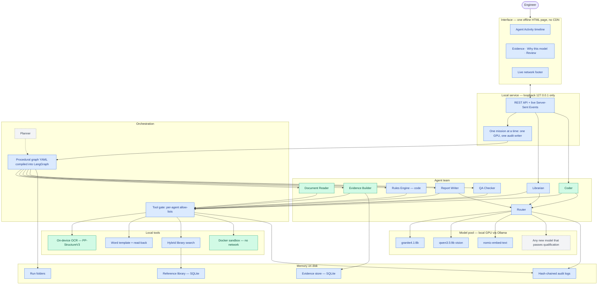
*Caption: agents never touch tools directly. Every call passes the gate, and
every model choice passes the Router.*

---

### C2. A regulated mission, end to end
*Place in section 6.*

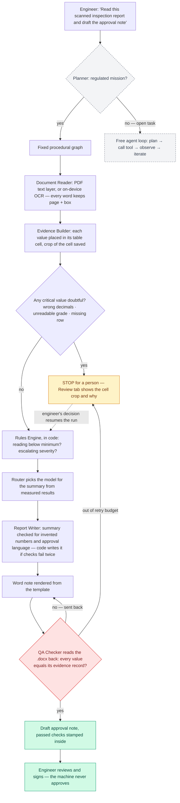
*Caption: two loops keep it safe. A wrong value in the file is sent back and
repaired; a doubtful value in the scan stops the run for a person.*

---

### C3. The inspection procedural graph, exactly as the YAML defines it
*Place in section 6.*

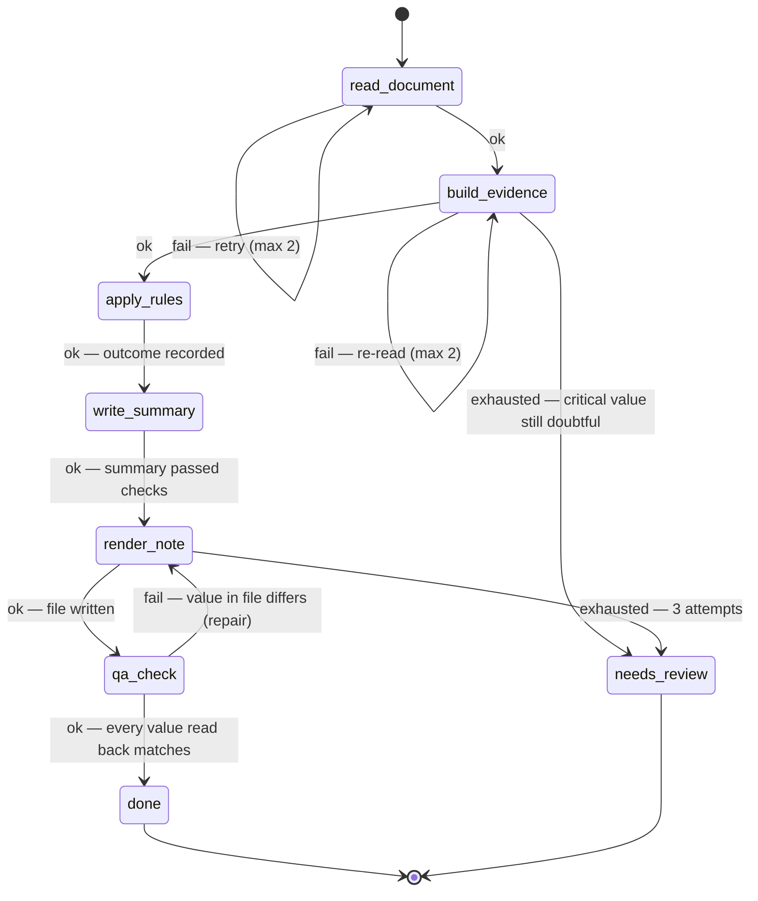
*Caption: the graph file is enforced, not advisory. Only these transitions are
possible, retries are budgeted, and there is a 20-step ceiling. Guidance and
pitfalls on each edge are inserted into the model's instructions.*

---

### C4. Reading a scan without guessing — and the damaged-digit catch
*Place in section 7.*

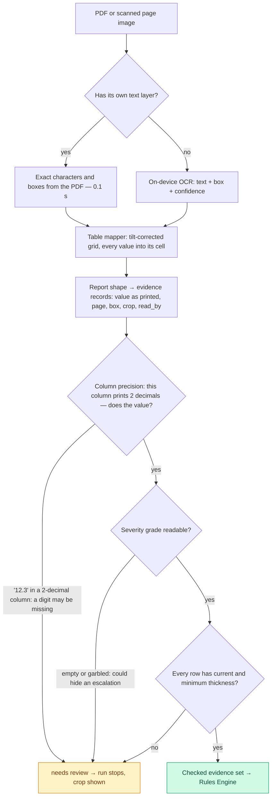
*Caption: `12.32` smudged reads as `12.3` at confidence 1.000 from two readers.
A bigger model did not catch it; a one-line check on a property of the printed
form did.*

---

### C5. Naive build vs our build on the same damaged cell
*Place in section 7, as a side-by-side.*

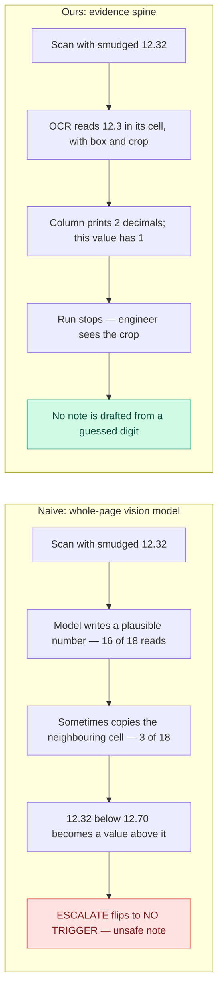

---

### C6. How the Router chooses a model
*Place in section 8.*

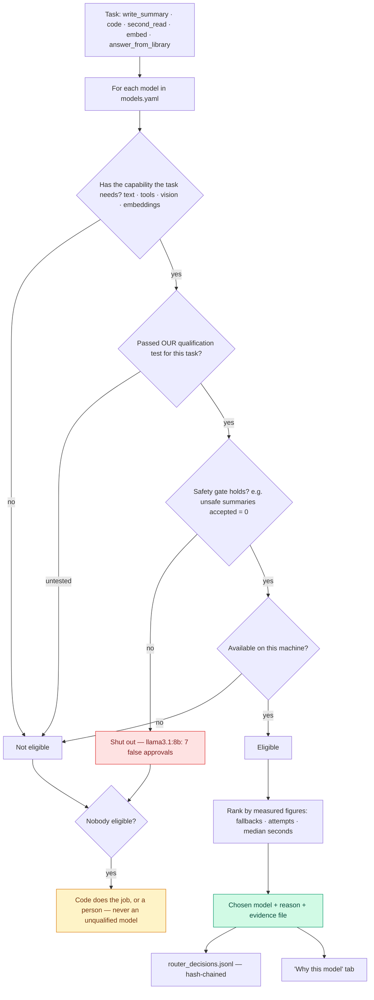
*Caption: models are plug-ins. A new model joins by passing the same test, with
no redesign.*

---

### C7. Knowledge base: build once, then answer with citations or refuse
*Place in section 9.*

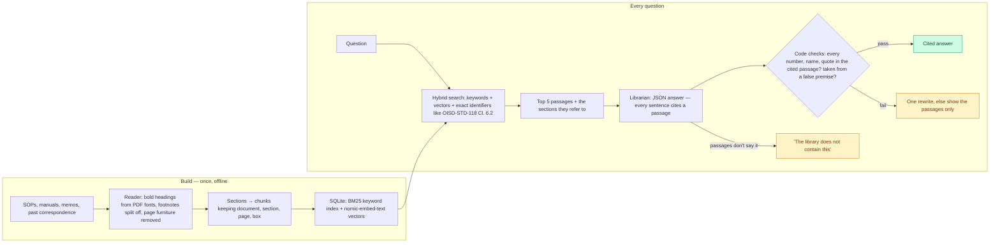
*Caption: the library supplies wording and citations, **never a value**. Numbers
in a deliverable come only from the evidence store or the document in hand.*

---

### C8. The Coder: write, run sealed, read the failure, fix
*Place in section 10.*

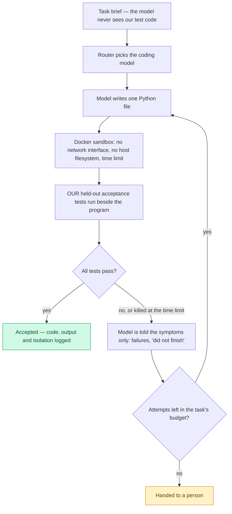
*Caption: the model does not mark its own homework. The tests were themselves
checked against a correct and a deliberately wrong solution, so we know they
catch errors.*

---

### C9. Orchestration: each stage runs as an agent, held to its tools
*Place in section 11.*

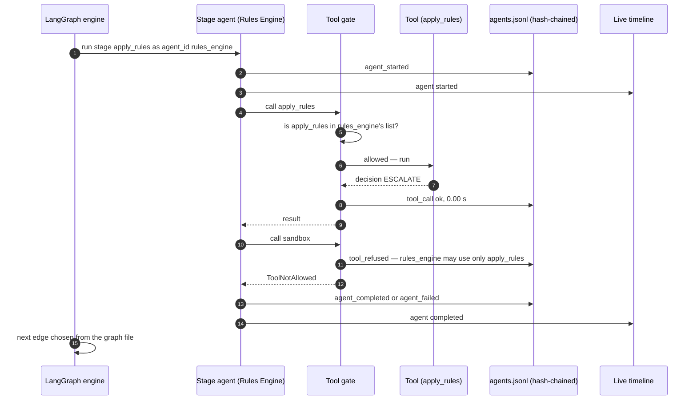
*Caption: agents differ in authority, not just in prompt. The refusal is an
event in a tamper-evident log, not a polite instruction to the model.*

---

### C10. Stop for a person, then resume exactly there
*Place in section 11. Label this diagram **Built**: 27/27 checks on the blurred
R-2247 scan, and the Review tab drives it in the live demo.*

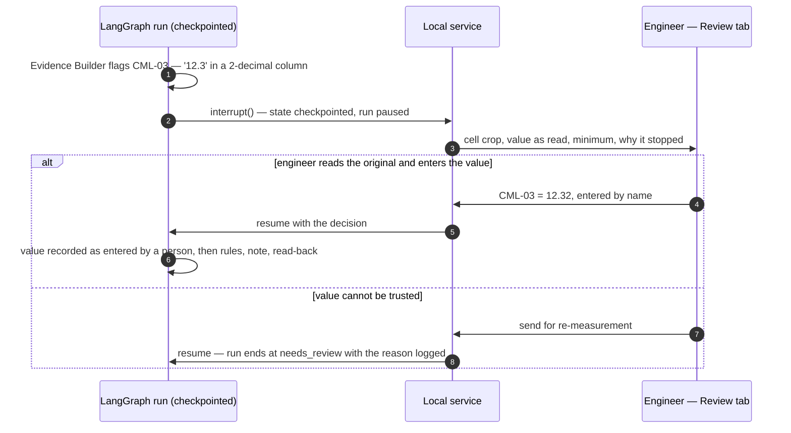

---

### C11. Three kinds of memory (CoALA), and who may change each
*Place in section 12.*

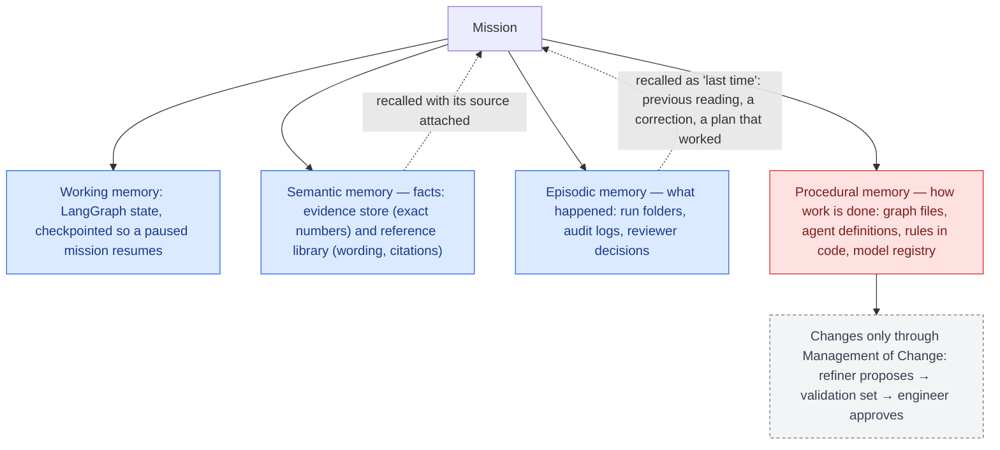
*Caption: a finished mission may add facts and history. No agent rewrites how
the work is done while it runs.*

---

### C12. Proving nothing leaves the machine
*Place in section 13.*

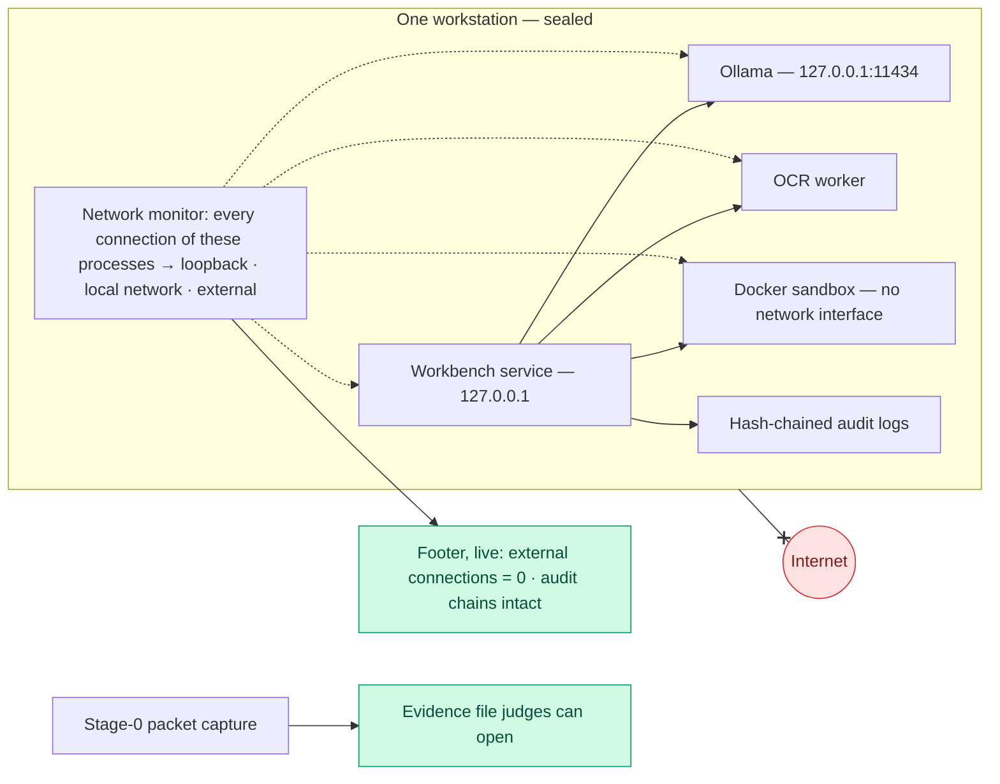

---

### C13. The live demo, in four beats (18–42 s, every step a real run)
*Place in section 15.*

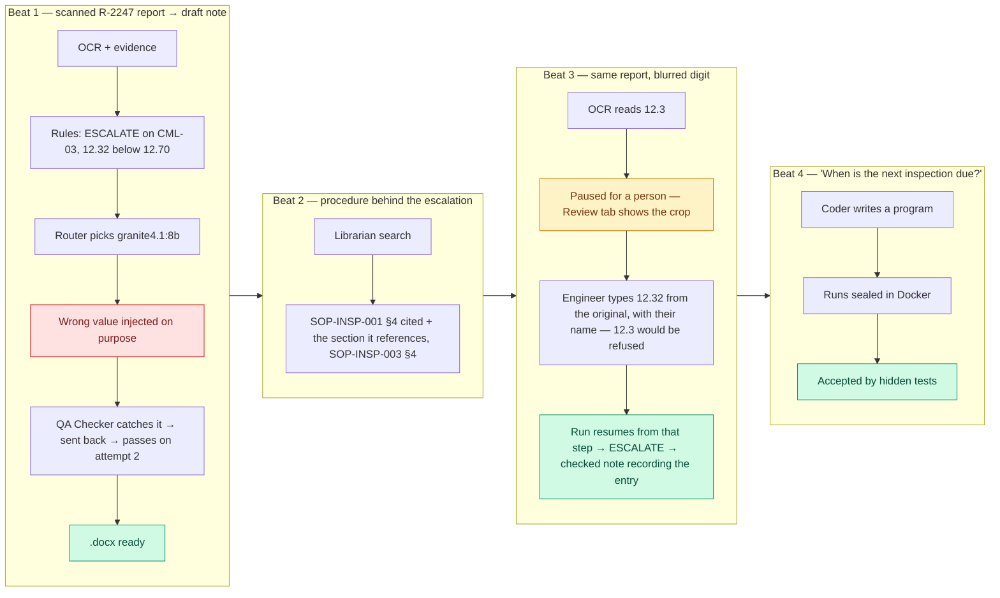
*Caption: throughout, the footer shows 0 external connections and every audit
chain intact.*

---

### C14. Roadmap — where each piece stands
*Place in section 20.*

```mermaid
flowchart LR
  classDef proven fill:#d1fae5,stroke:#059669,color:#064e3b
  classDef built fill:#dbeafe,stroke:#2563eb,color:#1e3a8a
  classDef proposed fill:#f3f4f6,stroke:#6b7280,color:#374151,stroke-dasharray:4 3

  subgraph NOW["Proven"]
    p1["Reader: 0 accepted wrong, 48 scans"]
    p2["Damaged-digit catch"]
    p3["Sandboxed Coder with hidden tests"]
    p4["Retrieval 22/22"]
    p5["Offline on a 12 GB GPU"]
  end

  subgraph BUILT["Built"]
    u1["Router + model registry"]
    u2["Self-healing Word note"]
    u3["LangGraph engine — 609/609 parity"]
    u4["Tool allow-lists + agent lifecycle log"]
    u5["Evidence store + reference library"]
    u6["Live interface + network footer"]
    u7["Stop for a person, resume from the Review tab"]
  end

  subgraph NEXT["Proposed — next"]
    x2["Planner: JSON plan validated in code"]
    x3["Excel and PowerPoint deliverables"]
    x4["Qualify a stronger Librarian + Verifier pass"]
    x5["PaddleOCR-VL-1.6 parser trial"]
    x6["Teams/Slack connector: notice, never content"]
    x7["Self-hosted Langfuse via OpenTelemetry"]
    x8["Photographs and drawings, once a model qualifies"]
  end

  NOW --> BUILT --> NEXT
  class p1,p2,p3,p4,p5 proven
  class u1,u2,u3,u4,u5,u6,u7 built
  class x2,x3,x4,x5,x6,x7,x8 proposed
```

---

## Part D — Closing line for the document

**"Safety came from cheap checks on the printed form and from code that decides,
not from a bigger model. That is the part that scales: the same rails, on any
model an organisation qualifies, entirely inside its own walls."**
